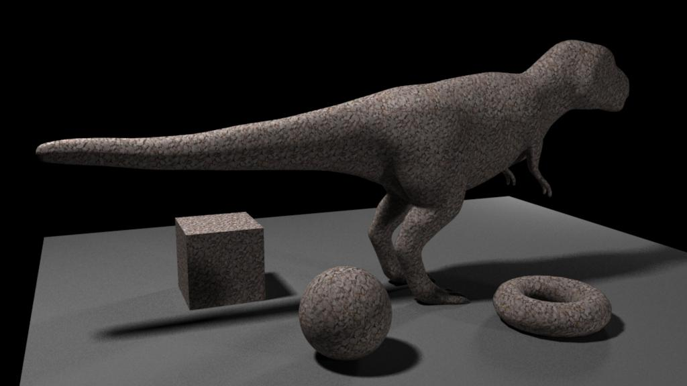

Texture Bombing
===============

The basic idea behind **texture bombing** is to divide UV space into a regular grid of cells. 
We then place an image within each cell at a random location, using a noise or pseudo-random number function. 
The final result is the composite of these images over the background.

According to this documents

http://developer.download.nvidia.com/books/HTML/gpugems/gpugems_ch20.html

https://medium.com/@bgolus/normal-mapping-for-a-triplanar-shader-10bf39dca05a

Texture bombing pattern contains the following sections:

* Textures - parameters for managing textures.
* Bombing - сontrols noise, samples, cell position and background color.
* Bombing.Mask - mask control.
* Triplanar - control for normal mapping(triplanar).

Installation and Registering instructions for Texture bombing
-------------------------------------------------------------

#### Maya 2018/2019
Environment Variables

    OSL - RMS_SCRIPT_PATHS

    export RMS_RMS_SCRIPT_PATHS = "/.../plugins"

Сompile TBombing_shader_v02.osl

    oslc TBombing_shader_v02.osl

Copy files in folder "/.../plugins"
(RenderMan_for_Maya.ini, 
RMSWorkspace.ini, 
TBombing_shader_v02.oso)

Doc link - https://vimeo.com/223801437

#### Katana 3
Environment Variables

    OSL - RMAN_SHADERPATH

Doc link  - https://rmanwiki.pixar.com/display/RFK22/Environment+Variables+in+Katana

Examples
--------

|  |
|:--:| 
| *initial settings* |

|  |
|:--:| 
| *bombing samples: 5* |

|  |
|:--:| 
| *bombing samples: 1, Radius: 1.2, falloff: -0.7* |

|  |
|:--:| 
| *texture rotate: 10, noise size: 15, bombing samples: 10, falloff: -0.5* |

|  |
|:--:| 
| *Filename: 01.tx, texture size: 0.016, texture rotate: 0, bombing samples: 1, falloff: 0* |

|  |
|:--:| 
| *bombing samples: 5* |

|  |
|:--:| 
| *Filename: 15.tx, texture size: 0.012, texture rotate: 5, noise size: 20, bombing samples: 5* |

#### Triplanar settings

|  |
|:--:| 
| *Filename: uv_checker.tx, texture size: 0.005, texture rotate: 0, noise size: 0, bombing samples: 5, Triplanar: Normal clamp (XYZ): 0, 1, 0* |

|  |
|:--:| 
| *Triplanar: Normal clamp (XYZ): 0, 0.3, 0* |

